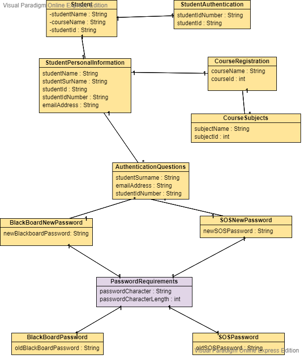

                Cput Reset Password Narrative

My CPUT Reset password will be a standalone application which the students can browse to.
                User journey:
A student forgets his or her password for Blackboard or SOS.
The student clicks on the forget password button on the SOS system.
The student is then required to fill out their student number and their South African Id number.
We do a check to see if there is such a student and retrieve the student details of the person and their personal information.
The student will then see their information such as the subject and course that they are register for.
They will also be allowed to change either their Blackboard or SOS password or both.
The system will then check if the password fulfills each requirement set out by the system. If the new password fulfills the requirements the password replaces the student’s old password.

